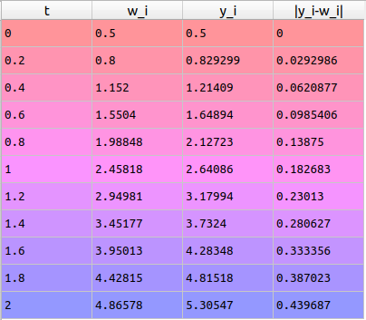
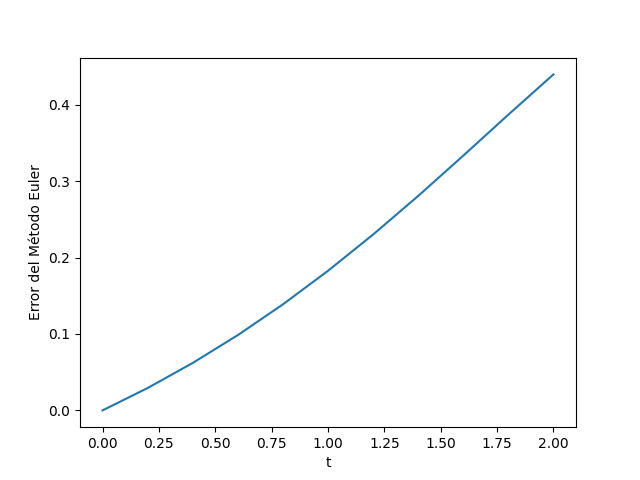

# Euler Method and Error Analysis

This repository presents a numerical implementation of the forward Euler method for first-order initial value problems, together with a LaTeX report that derives the method and discusses its global error bound.

The example problem is

$$\frac{dy}{dt}=y-t^2+1, \qquad 0\leq t\leq 2, \qquad y(0)=0.5,$$

whose exact solution is

$$y(t)=(t+1)^2-\frac{1}{2}e^t.$$

The Python script compares the Euler approximation with the exact solution and computes the absolute error at every grid point.

## Euler method

For the initial value problem

$$\frac{dy}{dt}=f(t,y), \qquad a\leq t\leq b, \qquad y(a)=\alpha,$$

the interval is divided into $N$ equal subintervals with step size

$$h=\frac{b-a}{N}.$$

Starting from $w_0=\alpha$, the forward Euler approximation is generated by

$$w_{i+1}=w_i+h f(t_i,w_i), \qquad i=0,1,\ldots,N-1.$$

Under the continuity, Lipschitz, and smoothness assumptions described in the report, the global error satisfies

$$\left|y(t_i)-w_i\right|\leq \frac{hM}{2L}\left[e^{L(t_i-a)}-1\right].$$

This estimate shows that the forward Euler method has first-order global accuracy: reducing the step size by a factor of two approximately halves the global discretization error when the remaining assumptions and numerical conditions are unchanged.

## Repository structure

```text
Euler_method/
├── python/
│   └── Euler_method.py
├── report/
│   ├── Euler_method_error.tex
│   ├── Euler_method_error.pdf
│   ├── plot1.png
│   └── table1.png
├── report_EN/
│   ├── Euler_method_error_EN.tex
│   └── Euler_method_error_EN.pdf
└── README.md
```

The `report` directory contains the original Spanish document. The `report_EN` directory contains the revised English translation.

## Requirements

- Python 3.8 or newer
- NumPy
- pandas
- Matplotlib
- A LaTeX distribution such as TeX Live or MiKTeX to compile the report

Install the Python dependencies with

```bash
python -m pip install numpy pandas matplotlib
```

## Running the numerical example

From the repository root, execute

```bash
python python/Euler_method.py
```

The script uses $N=10$ steps on $[0,2]$, prints the numerical values, computes the pointwise absolute error, and displays the exact and approximate solutions.

The main function has the signature

```python
Euler_method(a, b, N, alpha, f)
```

where:

- `a` and `b` are the interval endpoints;
- `N` is the number of equal steps;
- `alpha` is the initial value;
- `f` defines the differential equation $y'=f(t,y)$.

It returns the grid points and the corresponding Euler approximations as NumPy arrays.

## Numerical results

The report includes a table of the computed values and a plot comparing the numerical approximation with the exact solution.





## Compiling the English report

From the `report_EN` directory, run

```bash
pdflatex Euler_method_error_EN.tex
pdflatex Euler_method_error_EN.tex
```

Running LaTeX twice resolves cross-references.

## Limitations

The implementation is intentionally compact and educational. It uses a fixed step size, does not perform adaptive error control, and does not package the solver as a reusable Python module. The current plot is displayed interactively rather than saved automatically by the script.

## Author

**BSc. Julio A. Medina**<br>
Universidad de San Carlos de Guatemala<br>
School of Physical and Mathematical Sciences<br>
Master's Program in Physics<br>
[julioantonio.medina@gmail.com](mailto:julioantonio.medina@gmail.com)

## Reference

Richard L. Burden and J. Douglas Faires, *Numerical Analysis*, 9th ed., Brooks/Cole, Cengage Learning, ISBN 978-0-538-73351-9.
